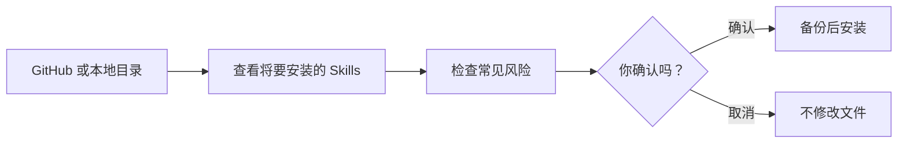

# Codex Skill Manager

> **先看清来源和风险，再让 Skill 进入 Codex。**

Codex Skill Manager 是面向 Windows 10/11 的本地 Skills 管理工具。它把 Skill 的下载、风险检测、安装、更新、卸载和分组管理放进一个清楚、可追溯、可回滚的流程。

[下载最新版](https://github.com/bme-lyh/Codex-Skill-Manager/releases/latest) · [快速开始](docs/user/getting-started.md) · [完整使用指南](docs/user/gui-guide.md) · [安全说明](SECURITY.md) · [English](README_EN.md)


[](https://github.com/bme-lyh/Codex-Skill-Manager/actions/workflows/ci.yml)

## 界面展示

[](docs/images/ui-carousel.gif)

> 动图展示主要界面。里面使用的分组、Skill 和路径都是示例，不包含真实账号或个人信息。

## 项目目的

Skill 会影响 Codex 的工作方式。手动复制虽然方便，但以后可能不知道它来自哪里、是否变过、出了问题如何恢复。

这个工具帮助你在一个界面里安装和整理 Skills，检查常见风险，并在更新或卸载前自动保留恢复材料。



## 基本功能

| 能力 | 说明 |
|---|---|
| 安装与下载 | 从 GitHub 公共/私有仓库或本地目录安装一个或多个 Skills |
| 风险检查 | 安装、更新或手动检查时显示风险原因和相关文件 |
| 更新与卸载 | 支持多选操作；更新前自动备份，卸载后可以恢复 |
| 分组整理 | 自动分组，也可以新建、改名和拖动分组 |
| 已有 Skills | 找出当前目录里的 Skills，并在不移动文件的情况下加入管理 |

## 使用 Codex 风险复核

Codex 风险复核是可选功能，默认关闭。启用前需要：

1. 安装并登录 **Codex CLI**；
2. 在应用的“设置”中启用 Codex 风险复核；
3. 确认你的 Codex 账户有可用额度。

复核会消耗 Codex 额度，所需时间与 Skill 数量、文件大小、所选模型和推理强度有关。应用默认逐组复核，失败组会自动重试一次；切换页面不会中断进度或丢失结果。不开启此功能时，本地风险检查和其他管理功能仍可正常使用。

## 三分钟开始

### 方式一：使用发布版

1. 从项目的 **GitHub Releases** 下载 Windows 压缩包。
2. 解压到一个固定目录。
3. 双击 `CodexSkillManager.exe`。
4. 第一次打开后，进入 **Skills** 页，选择“未管理”的项目，点击 **管理**。

应用默认读取 `%USERPROFILE%\.codex\skills`。`.system` 只显示、不修改。

### 方式二：从源码构建

需要 Go、Node.js、pnpm、WebView2 与 Wails v2：

```powershell
pnpm --dir frontend install
.\scripts\build.ps1
```

桌面程序位于 `build\bin\CodexSkillManager.exe`，CLI 位于 `build\bin\csm.exe`。桌面版必须通过 Wails 构建；直接使用 `go build` 构建 GUI 会缺少必要标签。

## 安全与恢复

- 下载的内容不会被自动执行。
- 安装和更新前会显示目标与风险，确认后才会修改文件。
- 更新前自动备份；卸载会移入隔离区，方便恢复。
- 本地修改不会在没有明确确认时被覆盖。
- Codex 复核是可选功能；默认检查完全在本地完成。

静态扫描无法证明内容绝对安全。完整边界与报告方式见 [安全策略](SECURITY.md)。

## 文档

- [入门与首次运行](docs/user/getting-started.md)
- [图形界面完整指南](docs/user/gui-guide.md)
- [安全检查说明](docs/user/security-scanning.md)
- [CLI 命令参考](docs/user/cli-reference.md)
- [开发者与 Agent 文档](docs/agent/AGENT-ENTRYPOINT.md)

## 项目状态

当前版本为 **0.7.6**，主要面向 Windows 10/11。项目仍在完善，重要操作前请查看计划并保留自动备份。

欢迎提交问题和改进建议。参与前请阅读 [贡献指南](CONTRIBUTING.md) 和 [行为准则](CODE_OF_CONDUCT.md)。

## 许可证

[MIT License](LICENSE)
