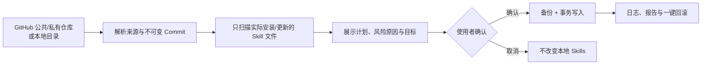

# Codex Skill Manager

> **先看清来源和风险，再让 Skill 进入 Codex。**

Codex Skill Manager 是面向 Windows 10/11 的本地 Skills 管理工具。它把 Skill 的下载、风险检测、安装、更新、卸载和分组管理放进一个清楚、可追溯、可回滚的流程。

[下载最新版](https://github.com/bme-lyh/Codex-Skill-Manager/releases/latest) · [快速开始](docs/user/getting-started.md) · [完整使用指南](docs/user/gui-guide.md) · [安全说明](SECURITY.md) · [English](README_EN.md)


[](https://github.com/bme-lyh/Codex-Skill-Manager/actions/workflows/ci.yml)

## 界面轮播

[](docs/images/ui-carousel.gif)

> GIF 会自动循环展示 12 个关键状态。截图来自隔离的匿名演示环境，使用三个示例分组和虚构 Skills，不读取真实 Skills、GitHub 凭据、Codex 登录信息、个人目录或操作日志；示例路径统一使用 `demo`。

## 项目目的

Skill 本质上是一组会影响 Agent 行为的指令和文件。直接复制到 `.codex/skills` 很方便，但也容易失去来源、版本和风险记录。

这个项目的目的很直接：

- 安装前知道 Skill 来自哪里、准备写入什么；
- 更新前看清文件变化和安全风险；
- 卸载或更新出错后能够恢复；
- 用图形界面完成日常操作，同时保留适合 Agent 使用的 CLI。



## 基本功能

| 能力 | 说明 |
|---|---|
| 风险检测 | 安装或更新前扫描实际 Skill 文件，说明风险等级、原因、证据和影响位置 |
| 下载与安装 | 支持 GitHub 公共/私有仓库、仓库内目录、`SKILL.md` 链接和本地目录 |
| 更新 | 检查远端 Commit，支持单个、多个、全选或反选，并在替换前自动备份 |
| 卸载 | 只处理明确选中的 Skill；内容先进入隔离区，不做永久批量删除 |
| 分组管理 | 自动按来源分组，也可新建、改名和拖动分组；分组布局不会改变更新来源 |
| 已有 Skills 管理 | 分析当前目录中的 Skills，识别来源并纳入管理，不移动原文件 |
| 恢复与回滚 | 每次修改都有事务日志；更新可回滚，隔离内容可恢复 |

### 进阶能力

- 风险命中按规则和文件用途归簇，可一次核查同类问题，同时保留完整原始证据。
- 可选调用已登录的 Codex CLI 做只读语义复核，模型和推理强度可配置。
- GitHub 凭据、API 限额、限流倒计时、缓存和失败重试均可在应用中查看。
- 本地修改未经明确确认不会被替换。
- GUI 覆盖日常操作；CLI 提供结构化 JSON，便于 Agent 和自动化调用。

## 三分钟开始

### 方式一：使用发布版

1. 从项目的 **GitHub Releases** 下载 Windows 压缩包。
2. 解压到一个固定目录。
3. 双击 `CodexSkillManager.exe`。
4. 第一次打开后，进入 **Skills** 页，选择“未管理”的项目，点击 **分析并管理**。

应用默认读取 `%USERPROFILE%\.codex\skills`。`.system` 只显示、不修改。

### 方式二：从源码构建

需要 Go、Node.js、pnpm、WebView2 与 Wails v2：

```powershell
pnpm --dir frontend install
.\scripts\build.ps1
```

桌面程序位于 `build\bin\CodexSkillManager.exe`，CLI 位于 `build\bin\csm.exe`。桌面版必须通过 Wails 构建；直接使用 `go build` 构建 GUI 会缺少必要标签。

## 安全模型

- GitHub 分支或标签先解析为不可变 Commit SHA。
- 下载内容一律视为不可信，只暂存、发现和扫描，不执行任何脚本。
- 安装和更新只扫描实际会写入的 Skill 目录，仓库级 README、CI 或测试不会造成无关误阻止。
- High 风险必须显式接受；Critical 默认阻止，逐条人工核查并记录忽略原因后可解除。
- 每次写入有明确目标、备份、事务日志、失败报告和恢复路径。
- “卸载”表示移动明确选中的单个 Skill 到隔离区，不永久批量删除。
- 云端或 LLM 扫描保持可选，默认纯本地。

静态扫描无法证明内容绝对安全。完整边界与报告方式见 [安全策略](SECURITY.md)。

## 文档

### 使用者

- [文档导航](docs/README.md)
- [入门与首次运行](docs/user/getting-started.md)
- [GUI 完整指南](docs/user/gui-guide.md)
- [CLI 命令参考](docs/user/cli-reference.md)
- [安全扫描与告警](docs/user/security-scanning.md)
- [备份、隔离与回滚](docs/user/backups-and-quarantine.md)
- [私有仓库](docs/user/private-repositories.md)
- [故障排查](docs/user/troubleshooting.md)

### 开发者与 Agent

- [Agent 开发入口](docs/agent/AGENT-ENTRYPOINT.md)
- [架构](docs/agent/architecture.md)
- [事务模型](docs/agent/transaction-model.md)
- [状态模型](docs/agent/state-model.md)
- [安全策略](docs/agent/security-policy.md)
- [测试指南](docs/agent/testing-guide.md)

## 项目状态

当前版本为 **0.7.1**，主要面向 Windows 10/11。项目仍在积极完善，建议在重要 Skills 上先审查计划并保留自动备份。

欢迎提交问题和改进建议。参与前请阅读 [贡献指南](CONTRIBUTING.md) 和 [行为准则](CODE_OF_CONDUCT.md)。

## 许可证

[MIT License](LICENSE)
