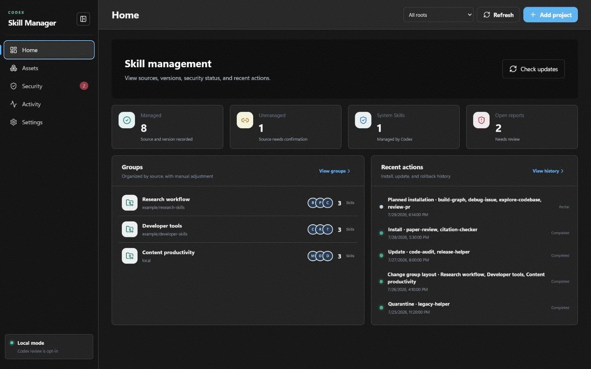

# Codex Skill Manager

> **Review the source. Check the risks. Install with rollback.**

Codex Skill Manager is a Windows app for understanding, checking, installing,
updating, organizing, and recovering Codex Skills. Changes are explicit,
logged, and reversible.

[Download v0.10.2](https://github.com/bme-lyh/Codex-Skill-Manager/releases/tag/v0.10.2) ·
[Get started](docs/en/getting-started.md) ·
[User guide](docs/en/gui-guide.md) ·
[Security](SECURITY_EN.md) ·
[中文](README_ZH.md)


[](https://github.com/bme-lyh/Codex-Skill-Manager/actions/workflows/ci.yml)

## Screenshots

[](docs/images/ui-carousel.en-US.gif)

The preview uses fictional Skills, groups, and paths. It contains no real
account or personal data.

## Current interface

The desktop shell has five top-level areas:

- **Home** summarizes managed and unmanaged Skills, system content, open
  reports, groups, and recent activity.
- **Assets** has the **Skills** and **Groups** tabs.
- **Security** scans selected Skills locally and shows findings and optional
  semantic review.
- **Activity** has **Updates**, **History & Rollback**, **Quarantine**, and
  **Reports** tabs.
- **Settings** contains language, storage, GitHub, scheduled checks, Codex
  review, and diagnostics.

## Add a project in four steps

The **Add project** dialog uses one flow for GitHub links and local directories:

1. **Source** accepts a repository, directory, or `SKILL.md` link. GitHub
   sources are resolved to a full commit; local sources are copied to a
   manager-owned snapshot.
2. **Understand & plan** automatically reads project documentation and markers,
   classifies the project, discovers Codex Skills, and runs the required local
   layered checks against the actual targets. Checks are grouped as required,
   conditional, or optional.
3. **Check & confirm** shows the evidence, selected targets, risks, permissions,
   and recovery path before any write. The assessment ends with one of four
   conclusions: **Ready to install**, **Review before installing**,
   **Installation blocked**, or **Assessment incomplete**.
4. **Install & result** writes only approved targets, records progress and a
   transaction, refreshes the latest Skills and operation status, and shows the
   recovery state. Completed changes can be rolled back from **History &
   Rollback**; removals can be restored from **Quarantine**.

The entry point presents one unified installation flow. For a complex repository, the technical **Run enhanced project scan**
action is under **More options**. Codex is an optional semantic-check provider:
it is read-only during scanning, has shell access disabled, and its findings or
plans still require local validation and explicit approval. **Switch to standard
installation** is also a technical action in **More options**, not a separate
entry flow.

The default Skills root is `%USERPROFILE%\.codex\skills`; `.system` is always
read-only. A project with no Codex Skill is not copied to that global folder.
Unsupported work remains manual, and any MCP project directory must be chosen
explicitly.

## Features

| Area | What it does |
|---|---|
| Understand and check | Reads project context, discovers Skills, scans exact targets, and exposes layered evidence before installation |
| Install and update | Applies selected Skills or reviewed plans, compares immutable source commits, and backs up replacements |
| Organize | Manages existing Skills without rewriting their content; creates and reorders groups |
| Recover | Uses transaction history, backups, and quarantine for reversible recovery |
| Automate | Provides the bundled `csm` CLI and optional Codex semantic workflows with structured records |

## Download and run

1. Download the standard or portable Windows archive from
   [GitHub Releases](https://github.com/bme-lyh/Codex-Skill-Manager/releases/latest).
2. Extract the archive to a stable directory.
3. Run `CodexSkillManager.exe`.

Portable builds store data beside the app. Standard builds use
`%USERPROFILE%\.codex\skill-manager`. The binaries are not Windows code-signed,
so SmartScreen may show a warning. Download only from this repository and
verify the archive against the included checksum file:

```powershell
Get-FileHash .\CodexSkillManager-0.10.2-windows-amd64.zip -Algorithm SHA256
```

Compare the result with `CodexSkillManager-0.10.2-SHA256SUMS.txt`.

### Add the bundled Codex Skill

Release archives include `agent-skill\codex-skill-manager`. To add it to the
global Codex Skills directory, open **Add project**, choose **Local directory**,
select the archive's `agent-skill` directory, review the four-step flow, and
install the selected Skill. From a source checkout, use
`skills\codex-skill-manager` instead.

## Safety rules

- Repository scripts, free-form commands, and arbitrary Codex text are never
  executed by the app.
- High risk requires individual confirmation and a reason; Critical risk
  cannot be ignored.
- Report-wide ignore applies only to known Medium-or-lower findings.
- Replacements are backed up, removals go to quarantine, and rollback refuses
  to overwrite content changed after installation.
- The Enhanced project scan is optional and read-only until you separately
  approve a typed plan and every required permission.

A clean scan is not proof that a Skill is safe. Read the
[security policy](SECURITY_EN.md) before approving unfamiliar sources.

## Build from source

Install Go 1.26, Node.js 22 or newer, pnpm 11.9, WebView2, and Wails v2, then run:

```powershell
pnpm --dir frontend install --frozen-lockfile
.\scripts\build.ps1
```

The desktop app and CLI are written to `build\bin`. The GUI must be built
through Wails; plain `go build` omits required desktop tags.

## Documentation

- [English documentation](docs/en/README.md)
- [中文文档](docs/README.md)
- [CLI reference](docs/en/cli-reference.md)
- [Architecture and Agent development](docs/agent/AGENT-ENTRYPOINT.md)
- [Contributing](CONTRIBUTING.md)

The unified shell is a UI refactor. Legacy Page routes and the Wails/API
compatibility boundary remain available for existing integrations; the visible
workflow is documented with the current labels above.

Codex Skill Manager 0.10.2 supports Windows 10/11 and is licensed under the
[MIT License](LICENSE).
