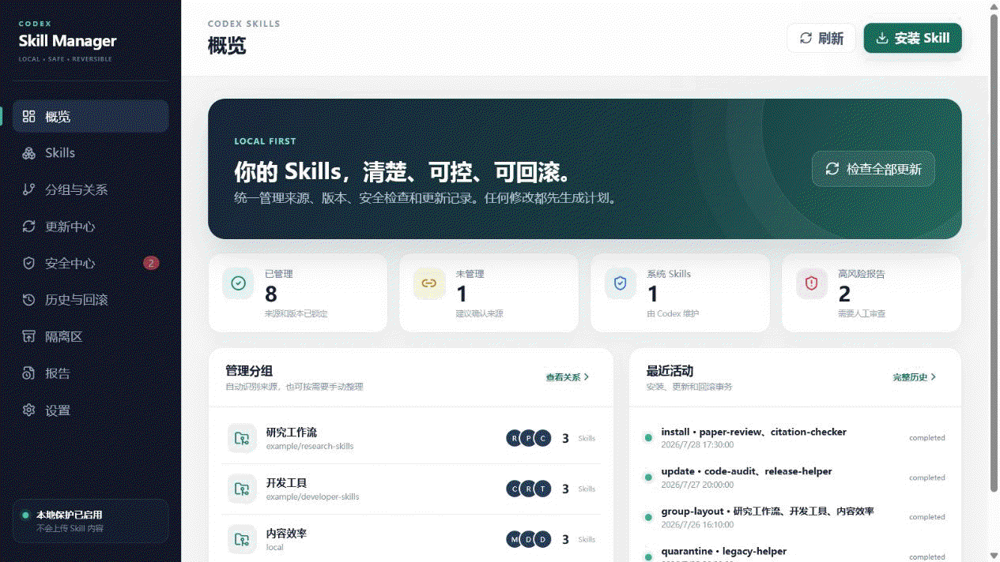

# Codex Skill Manager

> **Understand the source and the risk before a Skill reaches Codex.**

Codex Skill Manager is a local Windows 10/11 application for downloading, scanning, installing, updating, uninstalling, and grouping Codex Skills. Every change is designed to be traceable and recoverable.

[Latest release](https://github.com/bme-lyh/Codex-Skill-Manager/releases/latest) · [Getting started](docs/en/getting-started.md) · [GUI guide](docs/en/gui-guide.md) · [Security](SECURITY_EN.md) · [中文](README.md)

## Interface preview

[](docs/images/ui-carousel.gif)

> The animation uses fictional Skills, groups, and paths. It contains no real account or personal information.

## Purpose

Skills change how Codex works. Manual copying is easy, but later it may be hard to tell where a Skill came from, whether it changed, or how to recover it.

This app installs and organizes Skills in one place, checks common risks, and keeps recovery data before updates or removal.

## Core features

| Feature | What it does |
|---|---|
| Install | Install one or more Skills from public/private GitHub repositories or local folders |
| Risk checks | Show common risks and related files before installation, updates, or manual review |
| Update and remove | Support multi-selection, automatic backups, quarantine, and recovery |
| Groups | Group automatically or create, rename, and drag your own groups |
| Existing Skills | Add current Skills to management without moving their files |

## Optional Codex review

Codex review is off by default. To use it, install and sign in to **Codex CLI**, enable the feature in Settings, and make sure your Codex account has available usage.

Reviews consume Codex usage. Time and usage depend on the number and size of Skills, the selected model, and reasoning effort. The app reviews one group at a time, retries a failed group once, and keeps progress and results when you switch pages. All local checks and management features still work without Codex review.

## Quick start

### Release build

1. Download the Windows archive from **GitHub Releases**.
2. Extract it to a stable directory.
3. Run `CodexSkillManager.exe`.
4. Open **Skills**, select unmanaged items, and choose **Analyze and manage**.

The default Skills root is `%USERPROFILE%\.codex\skills`. The `.system` directory is always read-only.

### Build from source

Install Go, Node.js, pnpm, WebView2, and Wails v2, then run:

```powershell
pnpm --dir frontend install
.\scripts\build.ps1
```

Outputs are written to `build\bin`. The GUI must be built through Wails; plain `go build` omits required desktop build tags.

## Safety and recovery

- Downloaded content is not executed automatically.
- The app shows targets and risks before changing files.
- Updates create backups, and removed Skills go to quarantine for recovery.
- Local changes are not replaced without clear approval.
- Codex review is optional; the default checks stay local.

A clean static scan is not proof of safety. See the [security policy](SECURITY_EN.md) for limitations and vulnerability reporting.

## Documentation

- [English documentation](docs/en/README.md)
- [Chinese documentation](docs/README.md)
- [CLI reference](docs/en/cli-reference.md)
- [Architecture](docs/agent/architecture.md)
- [Contributing](CONTRIBUTING.md)

Current version: **0.7.5**. Licensed under the [MIT License](LICENSE).
