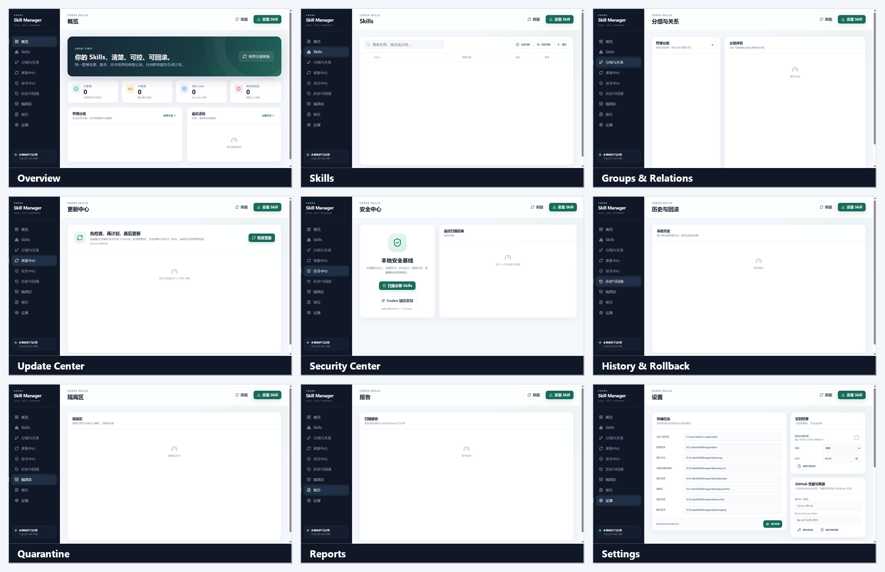

# Codex Skill Manager

> **Understand the source and the risk before a Skill reaches Codex.**

Codex Skill Manager is a local Windows 10/11 application for downloading, scanning, installing, updating, uninstalling, and grouping Codex Skills. Every change is designed to be traceable and recoverable.

[Latest release](https://github.com/bme-lyh/Codex-Skill-Manager/releases/latest) · [Getting started](docs/en/getting-started.md) · [GUI guide](docs/en/gui-guide.md) · [Security](SECURITY_EN.md) · [中文](README.md)

## Interface overview



> Privacy note: these screenshots use an isolated anonymous demo environment. They do not read real Skills, GitHub credentials, Codex sign-in data, personal directories, or operation logs. Example paths use the `demo` user.

## Purpose

Copying a Skill directly into `.codex/skills` is easy, but it loses source,
version, risk, and recovery information. This project provides a clear workflow
before and after every change.

## Core features

| Feature | What it does |
|---|---|
| Risk scanning | Scans actual Skill files before installation or update and explains severity, evidence, and affected locations |
| Download and install | Supports public/private GitHub repositories, repository paths, `SKILL.md` links, and local directories |
| Update | Checks remote commits, supports single or batch selection, and backs up before replacement |
| Uninstall | Moves only explicitly selected Skills to quarantine instead of permanently deleting them |
| Group management | Groups by source automatically and supports creating, renaming, and dragging groups |
| Existing Skills | Detects and manages Skills already present without moving their files |
| Recovery | Journals every mutation and supports rollback or quarantine restore |

Advanced capabilities include immutable GitHub commit resolution, duplicate
risk clustering, optional read-only Codex CLI review, GitHub rate-limit handling,
local-change protection, scheduled read-only update checks, and structured JSON
output for agents and automation.

## Quick start

### Release build

1. Download the Windows archive from **GitHub Releases**.
2. Extract it to a stable directory.
3. Run `CodexSkillManager.exe`.
4. Open **Skills**, select unmanaged items, and choose **Analyze and manage**.

The default Skills root is `%USERPROFILE%\.codex\skills`. The `.system` directory is always read-only.

### Build from source

Install Go, Node.js, pnpm, WebView2, and Wails v2, then run:

```powershell
pnpm --dir frontend install
.\scripts\build.ps1
```

Outputs are written to `build\bin`. The GUI must be built through Wails; plain `go build` omits required desktop build tags.

## Safety model

- Repository content is untrusted and never executed.
- GitHub refs are pinned before a plan is created.
- Only actual Skill installation targets affect the update gate.
- High findings require explicit acceptance. Critical clusters block by default and require a recorded human decision; deterministic baselines need an additional manual confirmation, and Codex cannot issue that override.
- Local changes are preserved unless replacement is explicitly approved.
- Every mutation has explicit targets, backup/quarantine behavior, a journal, structured output, and a recovery path.
- Cloud or LLM scanning remains opt-in.

A clean static scan is not proof of safety. See the [security policy](SECURITY_EN.md) for limitations and vulnerability reporting.

## Documentation

- [English documentation](docs/en/README.md)
- [Chinese documentation](docs/README.md)
- [CLI reference](docs/en/cli-reference.md)
- [Architecture](docs/agent/architecture.md)
- [Contributing](CONTRIBUTING.md)

Current version: **0.7.1**. Licensed under the [MIT License](LICENSE).
