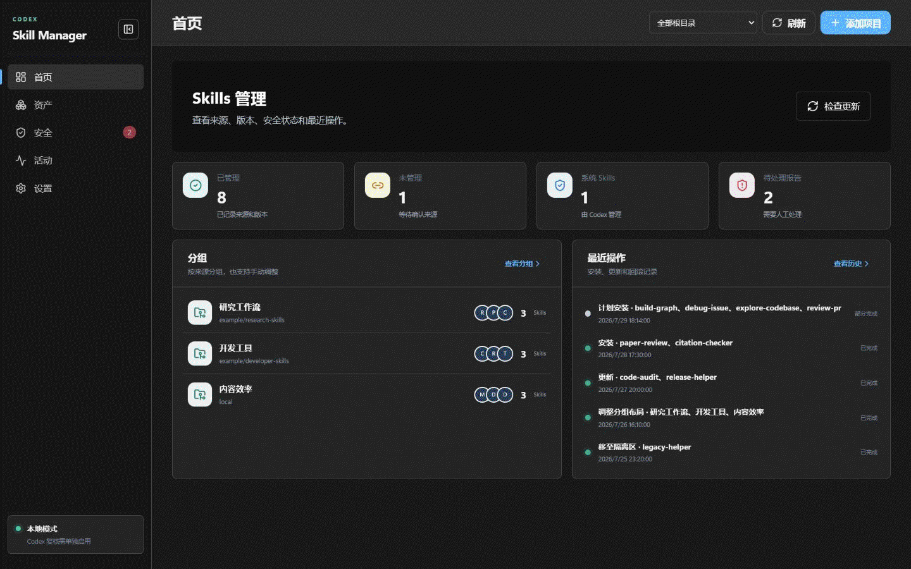

# Codex Skill Manager

> **先看来源，再看风险，确认后安装，随时可恢复。**

Codex Skill Manager 是一款 Windows 本地工具，用于理解、检查、安装、更新、整理和
恢复 Codex Skills。每次写入都会明确授权、记录事务，并保留恢复路径。

[下载 v0.13.0](https://github.com/bme-lyh/Codex-Skill-Manager/releases/tag/v0.13.0) ·
[快速开始](docs/user/getting-started.md) ·
[使用指南](docs/user/gui-guide.md) ·
[安全策略](SECURITY.md) ·
[English](README.md)

## 当前界面

[](docs/images/ui-carousel.zh-CN.gif)

图片使用虚构的 Skill、分组和路径，不包含真实账号或个人数据。所有画面统一为
1440×900；较长页面按滚动位置拆分展示，避免缩成一张长图。

桌面端一级导航固定为五项：

- **首页**：查看已管理、未管理和系统 Skills，未处理报告、分组与最近活动。
- **资产**：包含 **Skills** 和 **分组** 二级标签页。
- **安全**：在本地检查选中的 Skills，查看风险命中，也可进行可选语义复核。
- **活动**：包含 **更新**、**历史与回滚**、**隔离区** 和 **报告** 二级标签页。
- **设置**：配置语言、外观、存储位置、GitHub、定时检查、Codex 复核和诊断。

“设置”支持跟随 Windows、浅色和深色三种模式。扫描报告可以点击查看完整风险详情和
Codex 结论；更新状态按根目录区分，不会混淆 `.codex/skills` 与 `.agents/skills`。

## 四步添加项目

打开 **添加项目** 后，GitHub 链接和本地目录都使用同一条流程；默认入口是
**Codex 审核并受控安装**：

1. **来源**：输入仓库、目录或 `SKILL.md` 链接。GitHub 来源会解析并固定到完整
   Commit；本地来源会复制到应用管理的快照。
2. **理解与计划**：应用自动读取项目说明和标记，判断项目类型，发现 Codex Skills，
   并针对实际目标运行必选的本地分层检查。检查分为必选、条件触发和可选。
3. **检查与确认**：查看证据、安装目标、风险、权限和恢复方式，然后再允许写入。
   检查结论有四种：**可安装**、**需要确认**、**已阻止**、**检查未完成**。
4. **安装与结果**：Codex 审核完成后，人工一次确认即可让应用按已绑定计划完成受控步骤；只写入已批准的目标，记录进度和事务；完成后重新读取最新 Skills
   与操作状态，并显示恢复状态。已完成的变更可在 **历史与回滚** 中回滚，移除的内容
   可在 **隔离区** 中恢复。

Codex 审核入口在首屏可见。完成本地必选检查后，Codex 只读审核会自动开始；人工一次确认
即可让应用执行已绑定的受控安装计划。**标准 Skill 安装**仍可作为明确的替代选项。
应用不会执行来源仓库中的脚本、依赖安装、发布或清理命令。

应用同时管理 `%USERPROFILE%\.codex\skills` 与 `%USERPROFILE%\.agents\skills`；
新安装默认写入 Codex 目录。两个目录分别维护身份和状态，各自的 `.system` 都始终只读。
没有 Codex Skill 的普通项目不会被复制到全局目录。不支持自动化的工作会保留为人工步骤，需要配置
MCP 时必须由用户明确选择项目目录。

## 主要能力

| 领域 | 能力 |
|---|---|
| 理解与检查 | 读取项目上下文、发现 Skills、检查实际目标，并在安装前展示分层证据 |
| 安装与更新 | 应用选中的 Skills 或已复核计划，比较不可变来源 Commit，并在替换前备份 |
| 整理 | 管理已有 Skills 的来源与分组，不改写 Skill 内容 |
| 恢复 | 通过事务历史、备份和隔离区执行可逆恢复 |
| 自动化 | 提供内置 `csm` CLI 和可选的 Codex 语义工作流及结构化记录 |

## 下载和运行

1. 从 [GitHub Releases](https://github.com/bme-lyh/Codex-Skill-Manager/releases/latest)
   下载标准版或便携版 Windows 压缩包。
2. 解压到固定目录。
3. 运行 `CodexSkillManager.exe`。

便携版把数据保存在程序旁边；标准版使用
`%USERPROFILE%\.codex\skill-manager`。当前程序没有 Windows 代码签名，
SmartScreen 可能提示警告。请只从本仓库下载，并核对 SHA-256：

```powershell
Get-FileHash .\CodexSkillManager-0.13.0-windows-amd64.zip -Algorithm SHA256
```

将结果与 `CodexSkillManager-0.13.0-SHA256SUMS.txt` 中的对应行比较。

### 添加随包提供的 Codex Skill

发布包包含 `agent-skill\codex-skill-manager`。如需把它加入全局 Codex Skills，
请打开 **添加项目**，选择 **本地目录**，选中发布包内的 `agent-skill`，按四步流程检查
并安装选中的 Skill。源码检出目录对应 `skills\codex-skill-manager`。

## 安全边界

- 应用不会执行仓库脚本、自由格式命令或 Codex 生成的任意文本。
- 高风险（High）只需一次人工确认，应用自动记录审核决定；严重风险（Critical）仍是安全底线。
- 全选操作逐项执行，失败项不会阻止其他项，并提供子事务编号以便重试。
- 替换前备份，卸载后进入隔离区；目标被外部修改后，回滚不会强行覆盖。
- Codex 审核默认只读；确认时后端会重新校验来源、报告、权限和摘要，再进入事务执行。

“未发现风险”不等于绝对安全。批准陌生来源前，请阅读[安全策略](SECURITY.md)。

## 从源码构建

需要 Go 1.26、Node.js 22 或更高版本、pnpm 11.9、WebView2 和 Wails v2：

```powershell
pnpm --dir frontend install --frozen-lockfile
.\scripts\build.ps1
```

桌面程序和 CLI 输出到 `build\bin`。GUI 必须通过 Wails 构建。

## 文档

- [中文文档](docs/README.md)
- [English documentation](docs/en/README.md)
- [CLI 参考](docs/user/cli-reference.md)
- [开发者与 Agent 文档](docs/agent/AGENT-ENTRYPOINT.md)
- [贡献指南](CONTRIBUTING.md)

统一界面是一次 UI 重构；旧 Page 路由和 Wails/API 兼容边界仍然保留，以支持已有
集成。面向用户的说明统一使用当前界面术语。

Codex Skill Manager 0.13.0 支持 Windows 10/11，使用 [MIT License](LICENSE)。
